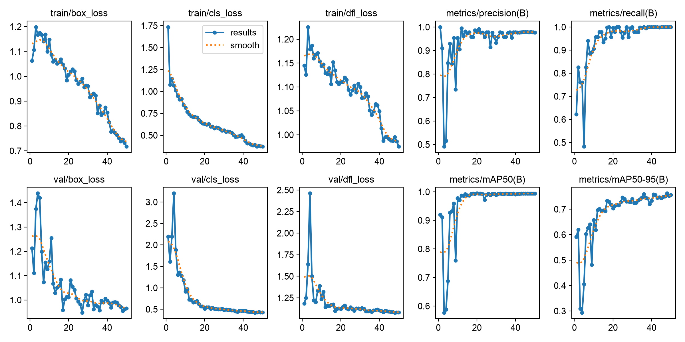
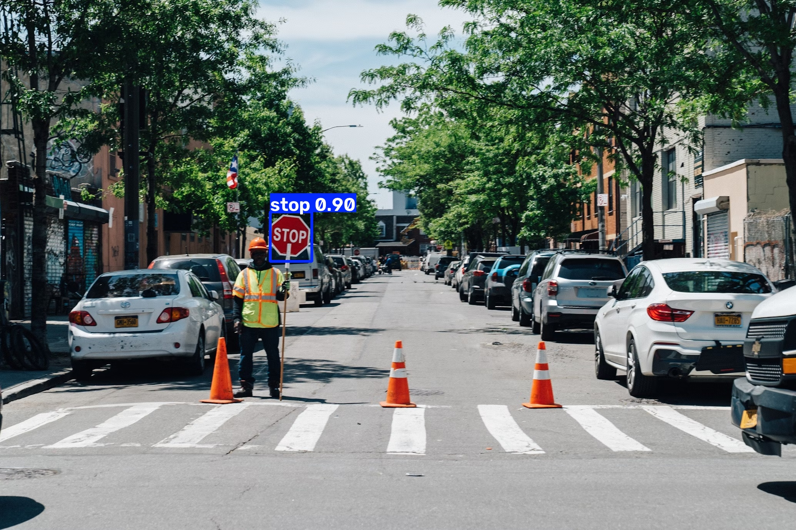
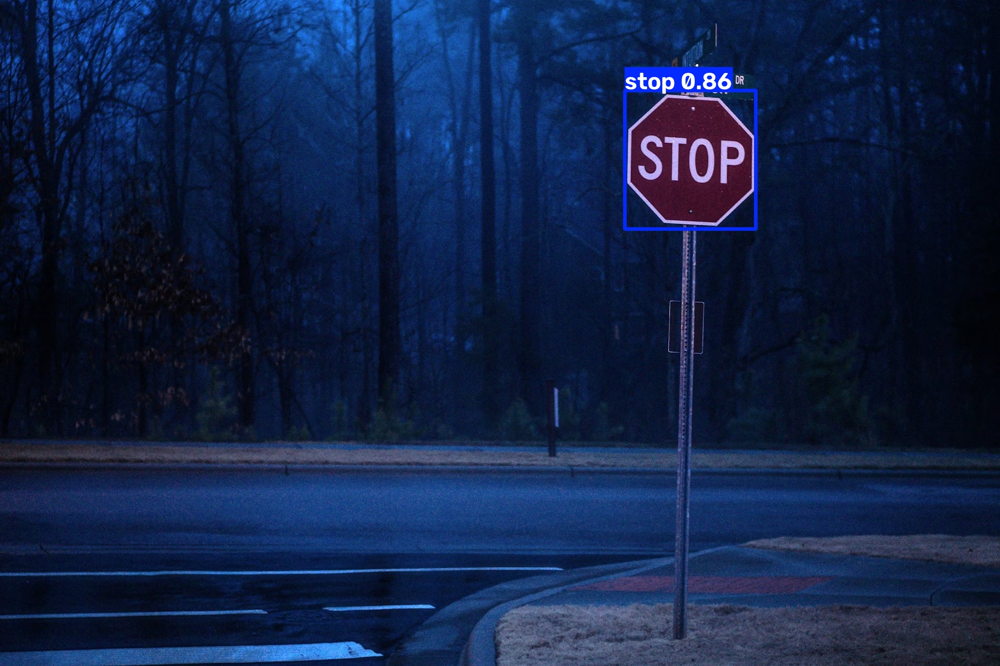
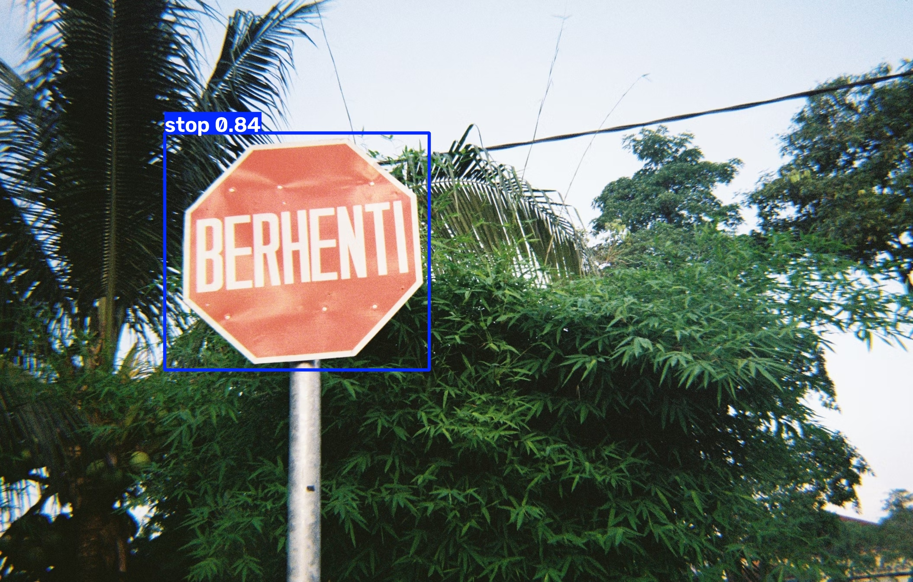
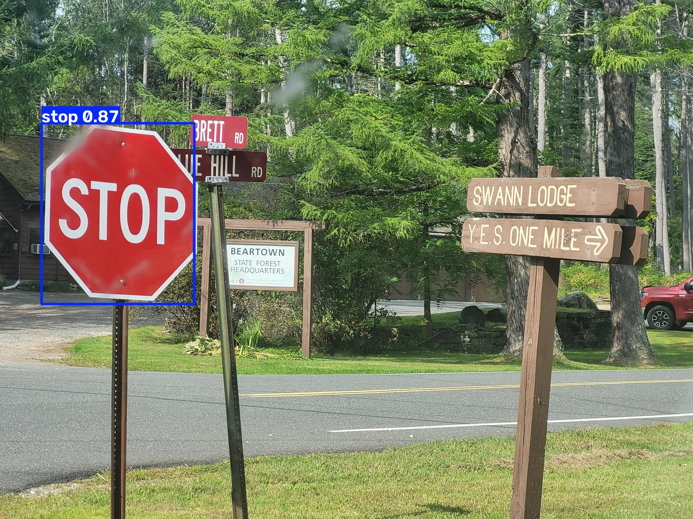
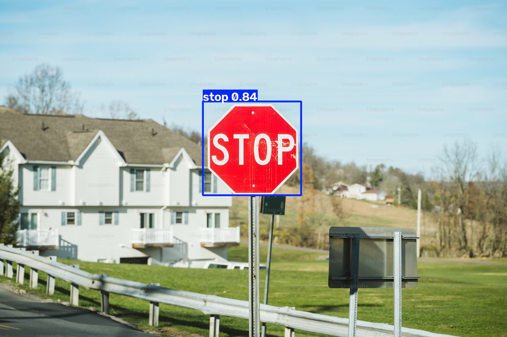
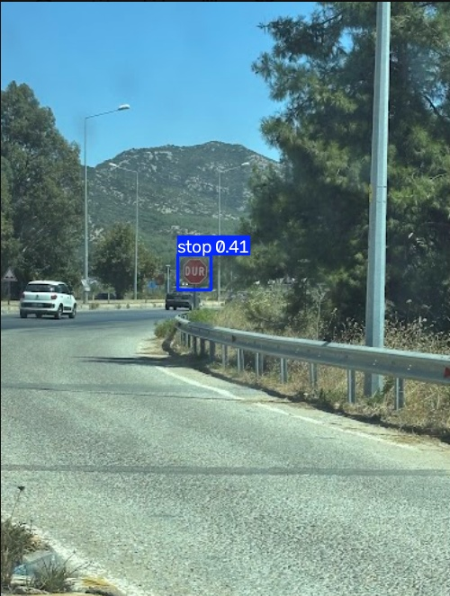

# YOLO ile Stop İşareti Tespiti - Yıldız Rover Ödev 3

Bu repository, Yıldız Rover yazılım ekibi görevleri kapsamında hazırlanan gerçek zamanlı "STOP" tabelası tespiti projesine ait eğitim kodlarını, model ağırlıklarını ve test çıktılarını barındırmaktadır.

## Veri Seti ve Eğitim Süreci
Modelin eğitimi için Roboflow platformundan temin edilen "STOP Sign" veri seti kullanılmıştır. Modelin eğitim verilerini ezberlemesini (overfitting) önlemek ve genelleme başarısını artırmak amacıyla veri seti `train` ve `valid` olarak ikiye ayrılmıştır.

**Uygulanan Eğitim Parametreleri:**
- `Epoch: 50`
- `Batch Size: 16` 
- `Image Size (imgsz): 640`
- `Optimizer: AdamW` 

## Eğitim Metrikleri ve Değerlendirme
50 epoch süren eğitim sürecine ait loss ve mAP metrikleri aşağıdaki grafikte gösterilmiştir:



Grafikler incelendiğinde; eğitim (train) ve doğrulama (val) aşamalarındaki `Box Loss` ve `Class Loss` değerlerinin istikrarlı bir şekilde düştüğü görülmektedir. Modelin genel başarımını ifade eden `mAP50` metriği 15. epoch civarında 1.0 (%100) seviyesine ulaşmıştır. Validasyon grafiklerinde yukarı yönlü bir kırılma (overfitting belirtisi) yaşanmadan eğitim başarıyla tamamlanmıştır.

## Test  Aşaması
Eğitim sonucunda elde edilen en iyi model ağırlıkları (`best.pt`) kullanılarak, modelin daha önce görmediği fotoğraflar üzerinde test işlemi yapılmıştır. Hatalı çizimleri önlemek için şu filtreler kullanılmıştır:
- **Confidence Threshold (conf): 0.50**
- **IoU Threshold (NMS):**

**Test Çıktıları:**








## Projeyi Çalıştırma
Projeyi kendi bilgisayarınızda denemek için aşağıdaki adımları izleyebilirsiniz:

```bash
# Repository'yi bilgisayarınıza indirin
git clone [https://github.com/berfinadiguzel21/ytu_rover_odev_3.git](https://github.com/berfinadiguzel21/ytu_rover_odev_3.git)
cd ytu_rover_odev_3

# Gerekli kütüphaneyi kurun
pip install ultralytics

# Modeli test fotoğrafları üzerinde çalıştırın
yolo task=detect mode=predict model=best.pt source=photo-1.jpg conf=0.50
